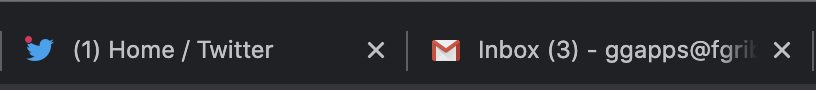
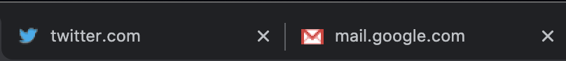

# Freeze Tab Title and Favicon

No more distraction from tab bar titles & favicon. 
New slack message `Slack | ! Username | 1 new item`, new email `Inbox (3)`, new tweet notification are a thing of the past. 
I want to go there when **I** want, not when they ask me to 😌

### Before

### After

### What does it do?

With Freeze Tab Title and Favicon:

- Every tab title *always* have the domain name (e.g. `mail.google.com`, `slack.com`).
- Every tab favicon *always* have the default favicon (`/favicon.ico`) if available.

### Why?

- 🌟 Reduce procrastination
- 🌟 Increase productivity

# Credits

Some part of the code were taken from [Lock Title by @imsut](https://github.com/imsut/locktitle).
Icons by [Oxy Nation](https://www.iconfinder.com/oxy-Nation).
